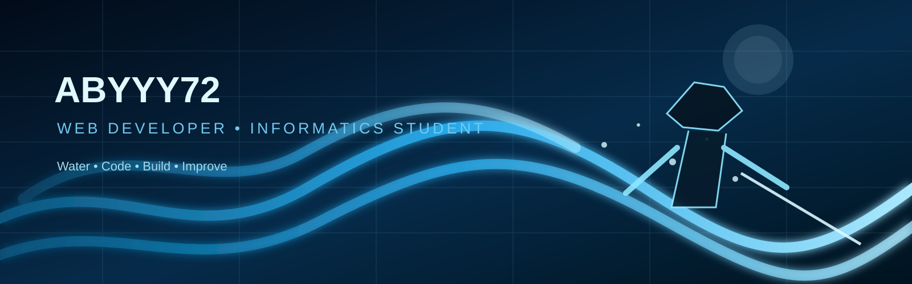

<div align="center">



# 🌊 ABYYY72

### 💻 Web Developer • Informatics Student • Tech Enthusiast

*静かに学び、コードで形にする。*  
*Learn quietly. Build with code.*

</div>

---

## 🧑‍💻 About Me

I'm an Informatics student who enjoys exploring **web development, programming, databases, and software projects**.

I like learning by building things — from small experiments to applications that can actually be used.

- 🎓 Informatics Student
- 💻 Interested in Web Development
- 🌱 Currently improving my programming skills
- 🗄️ Exploring databases & backend development
- 🚀 Building projects and learning through practice
- 🌊 Giyu / Water Breathing aesthetic enjoyer

---

## ⚔️ Tech Stack

### Languages

<p>


</p>

### Database & Tools

<p>


</p>

---

## 🌊 Featured Projects

### 🧾 Receipt Generator
A web application concept for creating customized receipts with company branding and distinctive designs.

**Focus:** Web Development • UI Design

### 💰 Cashier Project
A web-based cashier project for managing products and transactions.

**Focus:** CRUD • Database • Web Development

### 🎮 MLBB Tournament Project
A project concept related to organizing and managing a Mobile Legends tournament.

**Focus:** Tournament Management • Web Development

---

## 📚 Currently Learning

```text
WEB DEVELOPMENT
│
├── Frontend
│   ├── HTML
│   ├── CSS
│   └── JavaScript
│
├── Backend
│   └── PHP
│
├── Database
│   └── MySQL
│
└── Tools
    ├── Git
    └── GitHub
```

---

## 📊 GitHub Stats

<div align="center">


</div>

---

<div align="center">

### 🌊 「水のように静かに、コードのように確実に。」

**Learn • Build • Improve**

<br>


</div>
